  
  

  
  
  
  <h2>I use</h3>
  
  

    
  

  

    
    
    
  

  
  <h2>Connect with me on Discord: <a href="https://discord.com/users/446729269872427018" title="vyfor">@vyfor</a></h2>
  

